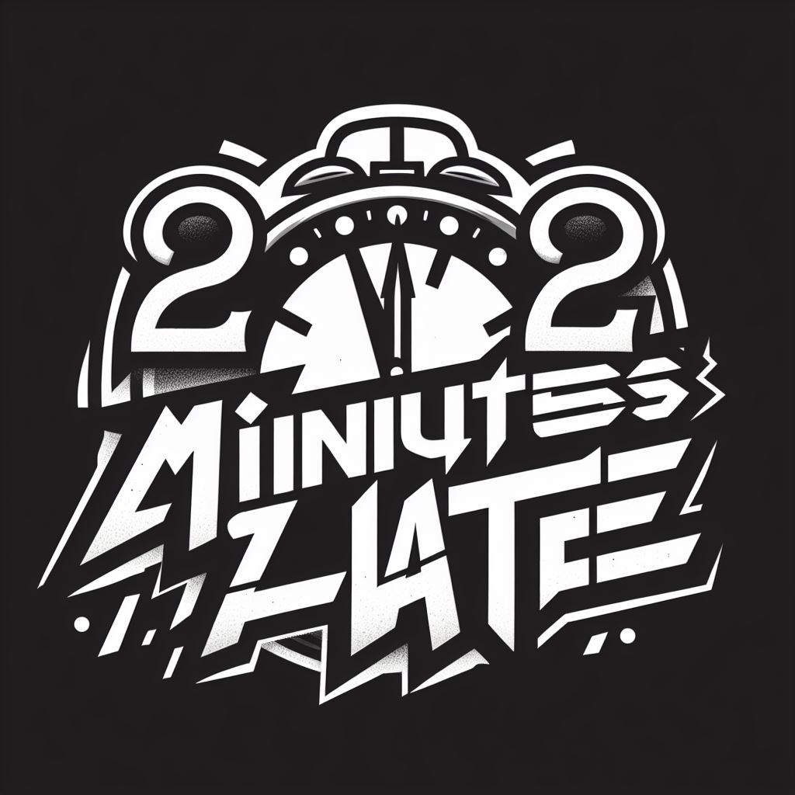

# 2Minutes2Late

Ein 2D JumpNRun Spielprojekt

## Mitwirkende

[Malte](https://github.com/EinfachMalte), [Leeroy](https://github.com/TheonlyTazz), Kevin, [Marcel](https://github.com/marcelgustin), [Adrian](https://github.com/YetiUnCode), Janek

## Ideen
- [x] Platform: Java
- Pixel
- Animationen
- MOvement
- Enemyhandling
- Mapmaking -> png
- 10 lvl.
- Endboss
- Story
- Punktesystem
- Waffensystem
- Inventar
- Paralaxhintergrund
- Goldsystem

## Lizenz

[GPL-3.0](https://choosealicense.com/licenses/gpl-3.0/)
